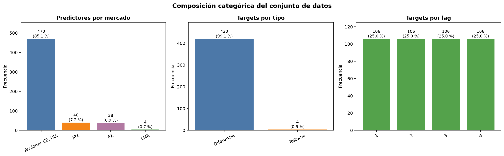
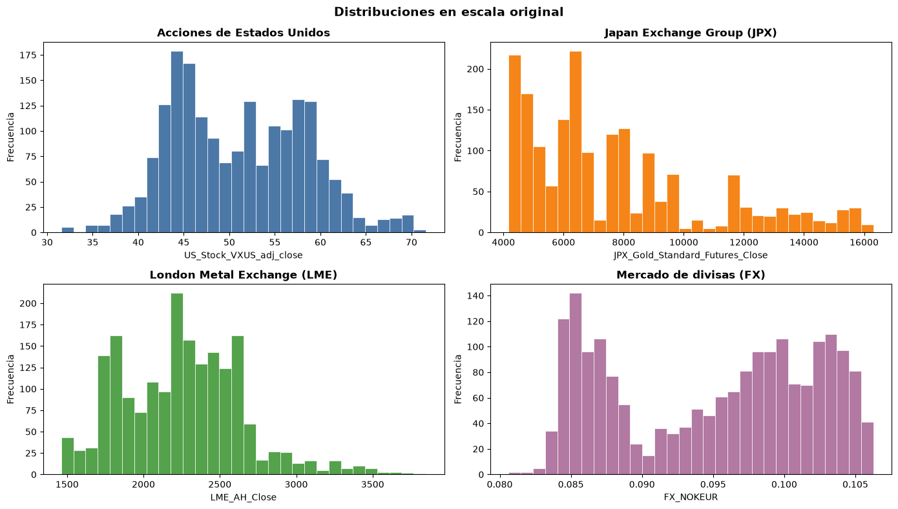
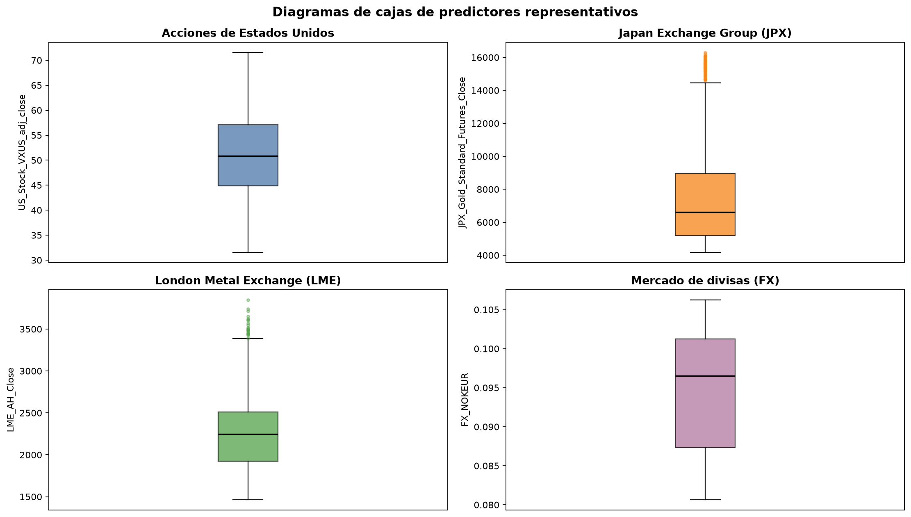
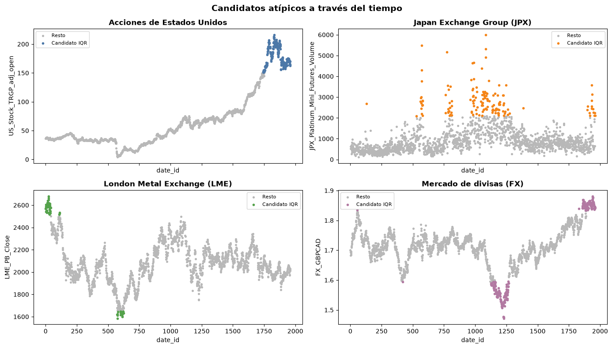
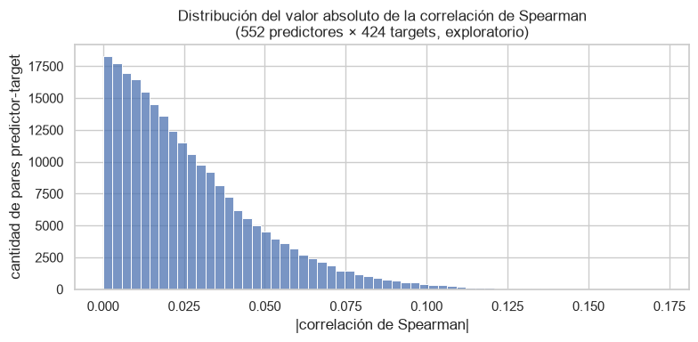
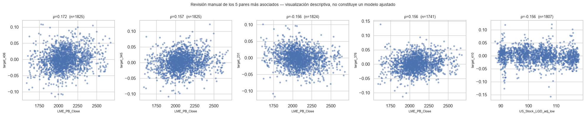
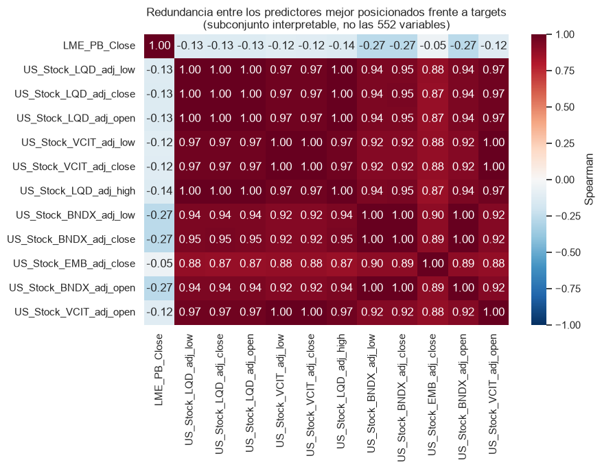
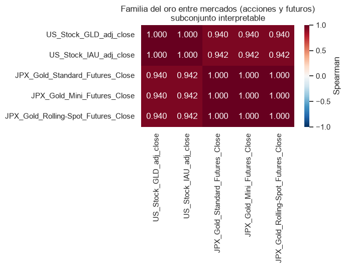

# Reto de predicción de retornos en mercados de materias primas

## Contexto del problema

Las materias primas, también conocidas como commodities, son bienes físicos
obtenidos principalmente de la agricultura, la producción energética o la
extracción de recursos naturales, los cuales sirven como insumos para el
funcionamiento de distintas actividades económicas. Sin embargo, no todas
presentan el mismo comportamiento, debido a que sus precios dependen de
condiciones particulares como la disponibilidad del recurso, los ciclos de
producción, la capacidad de almacenamiento, la demanda industrial y los
acontecimientos geopolíticos. Según el Banco Mundial (2022), los mercados de
materias primas son esenciales para la economía global, pero difieren
considerablemente en los factores que determinan su oferta, demanda y
comportamiento de precios. Por esta razón, comprender sus movimientos es
relevante para empresas, inversionistas y gobiernos que dependen de estos
recursos para tomar decisiones.

El reto seleccionado busca anticipar retornos futuros a partir de datos
históricos provenientes de la London Metal Exchange, Japan Exchange Group, el
mercado de acciones de Estados Unidos y el mercado de divisas. Según Demkin et
al. (2025), combinar información de estos mercados puede contribuir a construir
pronósticos más estables y apoyar la gestión del riesgo en los mercados globales
de materias primas. Sin embargo, el problema no se limita a predecir el precio
de un solo producto, debido a que el dataset contiene múltiples variables
objetivo derivadas de los retornos futuros de distintos activos o de las
diferencias entre pares de activos. Esta diversidad aumenta la complejidad del
análisis, ya que las relaciones pueden variar según el instrumento, el mercado y
el horizonte temporal utilizado. Ante este escenario, el análisis exploratorio
permitirá comprender cómo se organizan los datos, qué patrones comparten las
variables y cuáles podrían aportar información para una futura etapa de
selección de características y modelado.

Debido a la cantidad de variables, mercados y objetivos presentes, este
problema puede abordarse mediante Ciencia de Datos, comenzando por un análisis
exploratorio que permita estudiar la información antes de establecer supuestos
o construir modelos. Heckert y Filliben (2003) explican que este tipo de
análisis busca obtener una mayor comprensión del conjunto de datos, descubrir
su estructura interna, identificar variables importantes y detectar valores
atípicos o anomalías. En este proyecto, dicho enfoque permitirá evaluar la
calidad de los datos y reconocer asociaciones entre instrumentos, mercados y
variables objetivo. De esta forma, los hallazgos obtenidos podrán servir como
fundamento para decidir qué relaciones y características convendría investigar
en una futura etapa predictiva.

## Situación problemática

La predicción de retornos en mercados de materias primas representa una
dificultad debido a que los instrumentos financieros no se comportan de forma
aislada, sino que pueden responder a cambios en la oferta y demanda,
acontecimientos económicos y movimientos de otros mercados. En el reto de
MITSUI&CO., esta complejidad aumenta por la combinación de información histórica
proveniente de la London Metal Exchange, Japan Exchange Group, el mercado de
acciones de Estados Unidos y el mercado de divisas, junto con 424 variables
objetivo construidas a partir de distintos activos, pares de activos y
horizontes temporales (Demkin et al., 2025). Aunque esta diversidad permite
estudiar el comportamiento conjunto de diferentes instrumentos, también
dificulta reconocer cuáles relaciones son relevantes y si estas se presentan de
manera consistente.

Por otro lado, contar con una gran cantidad de datos no garantiza que todas las
variables aporten información útil para una futura etapa predictiva. La
presencia de variables poco relacionadas con los objetivos, información
redundante o patrones inestables puede introducir ruido y aumentar
innecesariamente la complejidad del problema. Por esta razón, el análisis
exploratorio se centrará especialmente en examinar las asociaciones entre
predictores y variables objetivo, buscando reconocer cuáles presentan un mayor
potencial informativo y cuáles aparentemente aportan poca señal. Estos
resultados permitirán reducir el espacio de variables que deberá investigarse
posteriormente y establecer una base fundamentada para una futura selección de
características, sin afirmar todavía que su capacidad predictiva ha sido
comprobada mediante modelos.

## Problema científico

El dataset del MITSUI&CO. Commodity Prediction Challenge integra una gran
cantidad de variables procedentes de distintos mercados y 424 variables
objetivo (Demkin et al., 2025). Sin embargo, antes de desarrollar modelos
predictivos, se desconoce cuáles variables o familias de variables presentan
asociaciones más fuertes y consistentes con los objetivos, cuáles parecen
aportar información similar o repetida y cuáles muestran poca señal aparente.
Esta falta de conocimiento dificulta establecer, con base en evidencia, qué
variables deberían considerarse candidatas para una futura etapa de selección
de características.

## Pregunta de investigación

¿Qué variables y familias de variables presentan las asociaciones más fuertes
y consistentes con los objetivos del MITSUI&CO. Commodity Prediction Challenge,
y cuáles parecen aportar información similar o repetida a partir del análisis
exploratorio?

## Objetivos

### Objetivo general

Analizar la estructura, calidad y relaciones presentes en las variables del
dataset del MITSUI&CO. Commodity Prediction Challenge mediante técnicas de
análisis exploratorio, con el fin de establecer candidatos para una futura
selección de características.

### Objetivos específicos

- Evaluar la estructura y calidad del dataset mediante el análisis de sus tipos
  de datos, valores faltantes, duplicados y valores atípicos.

- Analizar el comportamiento estadístico y las distribuciones de las variables
  cuantitativas mediante medidas descriptivas y representaciones gráficas.

- Comparar las asociaciones entre variables predictoras, familias de variables
  y variables objetivo para reconocer relaciones relevantes dentro y entre los
  mercados representados.

- Clasificar las variables y familias de variables como candidatas con mayor
  potencial informativo, información similar o repetida, o poca señal aparente,
  con base en los resultados del análisis exploratorio.

## **Descripción de los datos**

Los datos provienen del MITSUI&CO. Commodity Prediction Challenge de Kaggle
(Demkin et al., 2025) y se encuentran organizados en archivos complementarios,
no en un único CSV. Esta organización separa los predictores, las variables
objetivo y la metadata necesaria para interpretar los targets, de tal forma que
se puede analizar cada elemento sin confundir su función dentro del reto.

### **Estructura de los archivos**

| Archivo | Contenido | Observaciones | Columnas |
| --- | --- | --- | --- |
| train.csv | Predictores históricos para entrenamiento. | 1,961 | 558 |
| train_labels.csv | Valores históricos de las variables objetivo. | 1,961 | 425 |
| target_pairs.csv | Nombre, rezago y expresión de cada target. | 424 | 3 |
| test.csv | Predictores para la evaluación del reto. | 134 | 559 |

Las filas de train.csv y train_labels.csv se identifican mediante date_id, por
lo que cada una representa una misma fecha dentro de la serie histórica. Por
otro lado, las 557 columnas predictoras originales reúnen información de
acciones estadounidenses, la London Metal Exchange, Japan Exchange Group y
tipos de cambio. Estas variables incluyen precios de apertura, máximo, mínimo y
cierre, versiones ajustadas de precios y volumen, volúmenes, interés abierto,
precios de liquidación y tipos de cambio. Asimismo, train_labels.csv contiene
424 targets y target_pairs.csv documenta si cada uno representa el retorno de
un instrumento o la diferencia entre dos instrumentos, junto con su rezago de
uno a cuatro períodos.

### **Operaciones de preparación**

Primero, se conservaron los valores faltantes que ya venían del origen, ya que
presentan patrones asociados con la cobertura temporal de los distintos
mercados. En lugar de eliminar las filas con ausencias o imputar valores, se
mantuvieron como NaN para que cada análisis posterior utilice únicamente las
variables que necesita, sin romper la secuencia temporal completa.

Luego, se excluyeron las cinco variables cuyo nombre comienza con
US_Stock_GOLD_, debido a que su cobertura finaliza antes que la de los demás
predictores y no están disponibles en el conjunto de prueba. Finalmente, se
revisó la consistencia de las series
OHLC de acciones estadounidenses. Se identificaron 97 valores de apertura y 10
de cierre fuera del intervalo definido por el precio mínimo y máximo de su
misma fecha; estas 107 celdas se marcaron como NaN, sin modificar los valores
mínimos o máximos ni eliminar observaciones completas.

Como resultado, el archivo final de entrenamiento, train_eda.csv, conserva las
1,961 observaciones y 553 columnas: date_id y 552 predictores. El archivo final
de prueba, test_eda.csv, conserva sus 134 observaciones y 554 columnas,
incluyendo date_id, is_scored y los mismos 552 predictores disponibles en
entrenamiento. Estas operaciones se implementaron mediante un pipeline
reproducible, por lo que los datos crudos permanecen intactos y la versión
utilizada para el análisis puede regenerarse.

## **Análisis exploratorio**

El análisis exploratorio se desarrolló de forma progresiva, comenzando por la
calidad y composición del dataset, seguido por el comportamiento de las
variables cuantitativas y, finalmente, las relaciones entre predictores y
targets. Este orden permitió comprender primero qué información estaba
disponible y bajo qué condiciones podía utilizarse, para luego interpretar las
medidas estadísticas y gráficas sin introducir supuestos ocultos. Acorde a
Heckert y Filliben (2003), las técnicas utilizadas buscaron reconocer la
estructura interna de los datos, sus distribuciones, valores atípicos y
asociaciones relevantes.

### **Calidad y disponibilidad de la información**

Primero, se verificó que train_eda.csv y train_labels.csv conservaran los mismos
1,961 valores de date_id, en el mismo orden y sin duplicados. También se
comprobó que las variables predictoras fueran numéricas, que los 424 targets
tuvieran una única fila de metadata y que sus rezagos estuvieran comprendidos
entre uno y cuatro. Estas validaciones permitieron utilizar la alineación
entregada por la competencia sin desplazar manualmente las observaciones.

La revisión de completitud mostró que los valores faltantes no se distribuyen
de manera independiente. De las 1,961 observaciones, 1,731 contienen al menos
una ausencia y solamente 230 están completas en todas las variables
originales. No obstante, esta condición se explica principalmente por patrones
de cobertura compartidos: FX cubre las 1,961 fechas, LME aproximadamente 1,910,
las acciones estadounidenses alrededor de 1,894 y JPX 1,845. Por esta razón,
eliminar todas las filas con alguna ausencia habría reducido de forma severa la
serie y habría descartado datos válidos de otros mercados.

Se decidió conservar los valores faltantes estructurales y trabajar con
observaciones completas únicamente para las columnas involucradas en cada
cálculo. Asimismo, no se imputaron datos durante la preparación, ya que hacerlo
habría introducido valores estimados antes de comprender el patrón de cada
serie. Las cinco variables cuyo nombre comienza con US_Stock_GOLD_ se trataron
como una excepción porque su cobertura termina en date_id 258 y no aparecen en
el conjunto de prueba; por ello, se excluyeron como familia completa.
Finalmente, 97 aperturas y 10 cierres ajustados que se encontraban fuera del
intervalo definido por el mínimo y máximo de su misma fecha fueron rechazados
como NaN. En total se
modificaron 107 celdas, pero no se eliminó ninguna observación.

### **Composición categórica del dataset**

Aunque los predictores utilizados son cuantitativos, su nomenclatura y la
metadata permiten construir categorías estructurales para describir el
dataset. En particular, se clasificaron por mercado y tipo de medición,
mientras que los targets se estudiaron según su construcción y rezago. Estas
categorías no representan nuevas variables predictoras, sino una forma de
entender cómo se distribuye la información disponible.

| Mercado | Frecuencia de predictores | Proporción |
| --- | --- | --- |
| Acciones de Estados Unidos | 470 | 85.14 % |
| Japan Exchange Group | 40 | 7.25 % |
| Mercado de divisas | 38 | 6.88 % |
| London Metal Exchange | 4 | 0.72 % |
| **Total** | **552** | **100.00 %** |

La tabla muestra que el 85.14 % de los predictores proviene de acciones
estadounidenses. Esta concentración no significa que ese mercado contenga la
mayor señal predictiva, sino que cada uno de sus 94 instrumentos aporta cinco
mediciones ajustadas: apertura, máximo, mínimo, cierre y volumen. En contraste,
LME aporta únicamente cuatro variables de cierre. Por tanto, los resultados
globales pueden estar dominados numéricamente por las acciones, y fue necesario
resumir los hallazgos por mercado y medición.

| Característica del target | Categoría | Frecuencia | Proporción |
| --- | --- | --- | --- |
| Tipo | Diferencia entre dos instrumentos | 420 | 99.06 % |
| Tipo | Retorno de un instrumento | 4 | 0.94 % |
| Lag | 1 | 106 | 25.00 % |
| Lag | 2 | 106 | 25.00 % |
| Lag | 3 | 106 | 25.00 % |
| Lag | 4 | 106 | 25.00 % |

Los targets presentan una distribución equilibrada entre los cuatro rezagos,
pero no entre sus tipos: 420 de los 424 representan diferencias entre dos
instrumentos. Esto confirma que el problema se enfoca principalmente en
relaciones relativas entre activos, en lugar de predecir el retorno aislado de
un solo instrumento.

La gráfica de barras resume las frecuencias y proporciones por mercado, tipo
de target y rezago.

### **Comportamiento de las variables cuantitativas**

Para estudiar las 552 variables cuantitativas se calcularon, de forma
individual, la cantidad de observaciones disponibles, media, mediana,
desviación estándar, mínimo, cuartiles, máximo, rango e IQR. Luego, las medidas
se agruparon por mercado y tipo de medición, debido a que los niveles brutos no
son comparables entre precios, volúmenes, interés abierto y tipos de cambio.
También se utilizó el IQR relativo, calculado como IQR dividido entre el valor
absoluto de la mediana, para describir la dispersión respecto al nivel típico
de cada variable.

| Mercado | Predictores | Cobertura típica | IQR relativo típico |
| --- | --- | --- | --- |
| Acciones de Estados Unidos | 470 | 1,894 | 0.475 |
| Japan Exchange Group | 40 | 1,845 | 0.562 |
| London Metal Exchange | 4 | 1,910 | 0.230 |
| Mercado de divisas | 38 | 1,961 | 0.115 |

FX presenta la cobertura completa y la menor variabilidad proporcional típica.
Por otro lado, JPX posee la menor cobertura y el IQR relativo típico más alto,
lo que indica una mayor dispersión respecto a la mediana de sus propias
variables. Las acciones estadounidenses muestran una heterogeneidad amplia,
pues combinan instrumentos relativamente estables con otros que cambian de
forma considerable. Estos resultados describen la variabilidad interna, pero
no permiten concluir qué mercado posee mayor poder predictivo.

Dada la cantidad de columnas, se seleccionó un predictor representativo de
cada mercado para examinar su distribución. Primero se priorizó la cobertura
temporal, luego la cantidad de targets vinculados con el instrumento y, cuando
persistió el empate, el menor IQR relativo. La selección produjo
US_Stock_VXUS_adj_close, JPX_Gold_Standard_Futures_Close, LME_AH_Close y
FX_NOKEUR.

| Predictor | Mediana | IQR | Asimetría |
| --- | --- | --- | --- |
| US_Stock_VXUS_adj_close | 50.815 | 12.271 | 0.231 |
| JPX_Gold_Standard_Futures_Close | 6,621.000 | 3,756.000 | 1.066 |
| LME_AH_Close | 2,245.500 | 586.750 | 0.509 |
| FX_NOKEUR | 0.097 | 0.014 | -0.178 |

Los histogramas se presentan en la escala original de cada predictor.

US_Stock_VXUS_adj_close posee una asimetría positiva leve, mientras que
FX_NOKEUR mantiene una distribución prácticamente equilibrada. LME_AH_Close
presenta una cola derecha más visible y el futuro de oro de JPX alcanza la
mayor asimetría positiva, con una concentración de observaciones en niveles
bajos y medios y una extensión hacia precios altos. Además, los histogramas
muestran varios grupos o concentraciones, lo cual es consistente con series
financieras que atraviesan distintos niveles a lo largo del tiempo; por ello,
no se asumió que debieran seguir una distribución normal.

Los diagramas de cajas utilizan límites propios para cada variable y no
comparan directamente sus escalas.

Los diagramas de cajas complementan los histogramas al mostrar la mediana, el
50 % central de los datos y los valores fuera de los bigotes. El futuro de oro
de JPX y LME_AH_Close presentan observaciones por encima del bigote superior,
acorde a sus colas derechas. En cambio, VXUS y NOKEUR no muestran candidatos
visuales tan marcados bajo este criterio. No obstante, estos puntos todavía no
pueden considerarse errores, ya que el diagrama únicamente determina que se
encuentran alejados del rango central de su propia serie.

### **Valores atípicos y comportamiento temporal**

Posteriormente, se identificaron candidatos atípicos mediante los límites Q1
menos 1.5 veces el IQR y Q3 más 1.5 veces el IQR. El procedimiento se aplicó
por separado a cada predictor y se excluyeron sus NaN del cálculo, de tal forma
que una variable no condicionara la muestra utilizada por otra.

| Mercado | Observaciones disponibles | Candidatos IQR | Proporción |
| --- | --- | --- | --- |
| Acciones de Estados Unidos | 889,918 | 16,965 | 1.91 % |
| Japan Exchange Group | 73,800 | 2,694 | 3.65 % |
| London Metal Exchange | 7,640 | 130 | 1.70 % |
| Mercado de divisas | 74,518 | 693 | 0.93 % |

JPX registra la mayor proporción agregada, mientras que FX posee la menor. Sin
embargo, para interpretar estos resultados se seleccionó el predictor con la
mayor incidencia dentro de cada mercado y se ubicaron sus candidatos sobre
date_id.

Los puntos coloreados representan candidatos detectados mediante IQR; el
resto de las observaciones se muestra en gris.

La figura muestra que una parte importante de los candidatos aparece en
períodos consecutivos y no como errores aislados. FX_GBPCAD alcanza 231
candidatos y una racha de hasta 112 fechas; US_Stock_TRGP_adj_open posee 205 y
una racha de 43; LME_PB_Close registra 66 y una racha de 41. Por otro lado,
JPX_Platinum_Mini_Futures_Volume contiene 142 candidatos distribuidos en
concentraciones más cortas. Bajo esta idea, los puntos pueden reflejar cambios
sostenidos de nivel o actividad, por lo que se conservaron. En una etapa de
modelado sería posible comparar un escenario sin tratamiento con alternativas
que limiten los extremos, pero el EDA no aporta evidencia suficiente para
eliminarlos.

### **Relaciones entre predictores y targets**

Para explorar las relaciones con las variables objetivo se calculó la
correlación de Spearman entre cada predictor y cada target. Se eligió esta
medida porque permite reconocer asociaciones monotónicas sin requerir una
relación lineal ni escalas equivalentes. Cada coeficiente utilizó únicamente
las fechas disponibles para su pareja, sin imputación; el número de
observaciones varió entre 1,516 y 1,961, con una mediana de 1,717.

En total se evaluaron 234,048 pares. La mediana de la correlación absoluta fue
0.021, el tercer cuartil alcanzó 0.038 y el máximo fue 0.172. En otras
palabras, la gran mayoría de las asociaciones se encuentra cerca de cero.

La distribución contiene las 234,048 correlaciones absolutas de Spearman.

El predictor mejor posicionado fue LME_PB_Close, con una correlación de 0.172
frente a target_406 en el lag 4. También apareció repetidamente frente a otros
targets de los lags 2, 3 y 4. Cabe mencionar que varios de estos targets
incluyen al mismo LME_PB_Close dentro de su definición, de tal forma que su
posición es estructuralmente razonable y no representa necesariamente una
señal externa.

También se identificó un grupo formado por LQD, VCIT, BNDX y EMB, cuyas
mediciones de precio presentan correlaciones negativas cercanas a -0.15 con
target_410, definido a partir de FX_EURUSD y LME_AH_Close para el lag 4. Estas
asociaciones sugieren un posible comportamiento compartido entre bonos,
divisas y metales. Sin embargo, 15 de los 20 pares mejor posicionados
corresponden al mismo target y a mediciones relacionadas de esos ETFs, por lo
que no constituyen quince señales independientes.

Cada panel muestra el coeficiente de Spearman y la cantidad de observaciones
utilizadas.

Los dispersogramas permiten observar tendencias débiles, pero mantienen una
dispersión considerable alrededor de ellas. Por esta razón, los predictores se
clasificaron como candidatos con señal aparente y no como variables con
capacidad predictiva comprobada.

### **Redundancia entre predictores**

Finalmente, se estudió la correlación entre los propios predictores para
identificar información posiblemente repetida. De los 152,076 pares únicos,
6,426, equivalentes al 4.23 %, presentan una correlación positiva igual o
superior a 0.90, mientras que únicamente 76 pares muestran una correlación
negativa igual o inferior a -0.90.

La redundancia más clara aparece entre la apertura, máximo, mínimo y cierre
ajustados de un mismo instrumento estadounidense. La correlación media entre
estas cuatro mediciones es 0.999 para los 94 tickers, lo que indica que
describen prácticamente el mismo nivel de precio diario. Asimismo, LQD, VCIT,
BNDX y EMB mantienen correlaciones elevadas entre ellos, aproximadamente entre
0.87 y 0.97.

El mapa de calor utiliza únicamente un subconjunto interpretable de los
predictores mejor posicionados frente a los targets.

La familia del oro presenta un patrón similar. GLD e IAU poseen una correlación
prácticamente perfecta, al igual que los tres contratos de oro de JPX. Entre
los ETFs estadounidenses y los futuros japoneses, los coeficientes se
encuentran alrededor de 0.94, lo que sigue representando una asociación fuerte,
aunque menor que la observada dentro de cada mercado.

La relación es prácticamente perfecta dentro de cada mercado y cercana a
0.94 entre mercados.

Estos resultados permiten identificar familias candidatas para una futura
selección de características. No obstante, no se decidió eliminar columnas
durante el EDA, ya que variables correlacionadas pueden aportar información
complementaria mediante interacciones o responder de manera distinta durante
otros períodos.

### **Resumen de lo encontrado**

En conjunto, el análisis mostró que las ausencias son principalmente
estructurales y que conservar la secuencia temporal resulta más apropiado que
eliminar todas las filas incompletas. Las distribuciones y los candidatos
atípicos difieren entre mercados, pero varios extremos forman períodos
continuos que pueden corresponder a movimientos reales. Por otro lado, las
asociaciones individuales con los targets son débiles, mientras que la
redundancia dentro de algunas familias es considerable.

Dicho esto, las correlaciones de Spearman únicamente describen relaciones
monotónicas individuales, por lo que pueden omitir interacciones y patrones no
lineales. Además, el ranking surge de más de 234,000 comparaciones y todavía no
se ha validado mediante divisiones temporales o modelos. Por ello, LME_PB_Close,
los ETFs de bonos y las familias redundantes se conservarán como candidatos a
probar, y las decisiones finales de inclusión o exclusión deberán tomarse en
una etapa predictiva.

## Referencias

Banco Mundial. (2022). Commodity markets: Evolution, challenges, and
policies. https://www.worldbank.org/en/research/publication/commodity-markets

Demkin, M., Takano, N., Rai, R., Dane, S., & Kitayama, T. (2025).
MITSUI&CO. Commodity Prediction Challenge. Kaggle.
https://www.kaggle.com/competitions/mitsui-commodity-prediction-challenge

Databento. (2024, 4 de marzo). Working with high-frequency market data: Data
integrity and cleaning. https://databento.com/blog/data-cleaning

Heckert, N. A., & Filliben, J. J. (2003). NIST/SEMATECH e-Handbook of
Statistical Methods: Chapter 1, Exploratory Data Analysis. National Institute
of Standards and Technology.
https://www.nist.gov/publications/nistsematech-e-handbook-statistical-methods-chapter-1-exploratory-data-analysis

Verousis, T., & ap Gwilym, O. (2010). An improved algorithm for cleaning ultra
high-frequency data. Journal of Derivatives & Hedge Funds, 15(4), 323-340.
https://doi.org/10.1057/jdhf.2009.16
